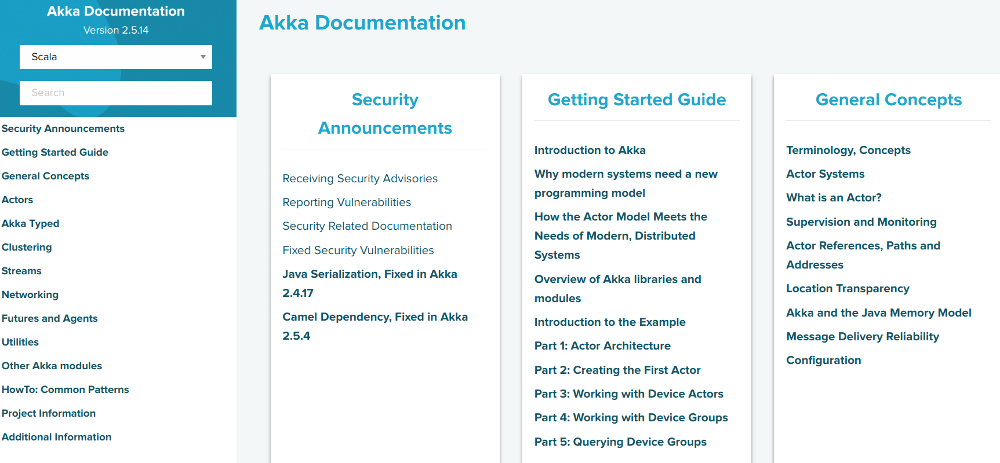
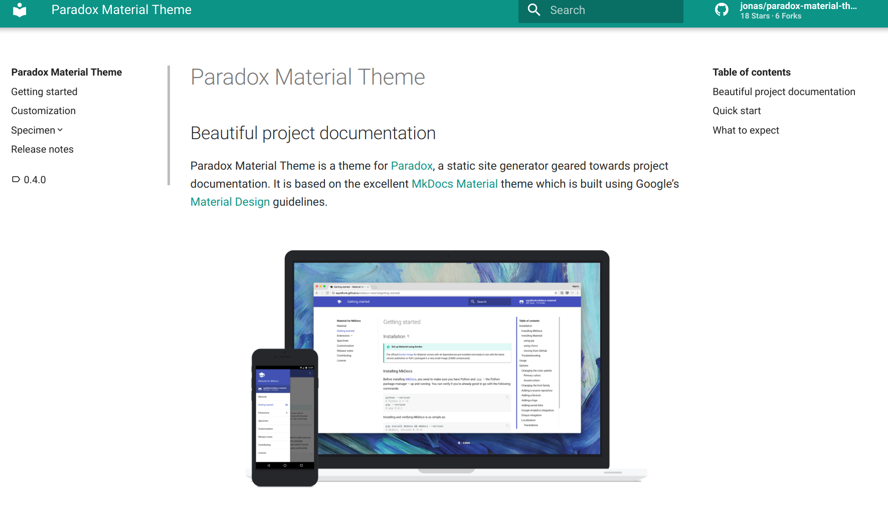

# Pre-packaged Extensions

## Themes

 * [Akka Paradox Theme + Extensions](https://github.com/akka/akka-paradox): Custom theme used by the 
   [Akka documentation](https://akka.io/docs/akka/):
   
   
   
 * [Paradox Material Theme](https://github.com/jonas/paradox-material-theme): A theme built using Google's Material Design
   guidelines:
   
   

## Directives

 * [Apidoc directive](https://github.com/lightbend/sbt-paradox-apidoc): `@apidoc` directive that will automatically
   create links to Java Apidoc or Scala Scaladoc depending on a language choosing dropdown
   
 * [Dependencies directive](https://github.com/lightbend/sbt-paradox-dependencies): Lists the direct and transitive dependencies of the specified sbt project.

   
   
 * [Project-info directive](https://github.com/lightbend/sbt-paradox-project-info): Shows a standardised project information section which is controlled from a configuration file.

   
