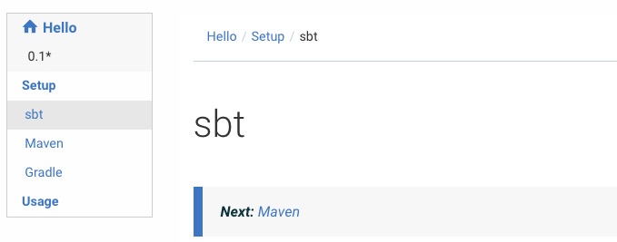
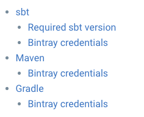

Organizing pages
================

### titles

In your markdown files, you can specify titles by using `#` characters. Less there are `#`, bigger the title is. You can also specify titles by using `=` and `-` respectively giving the same result than `#` and `##`. For example,
```markdown
myTitle
-------
```
is equivalent to
```markdown
## myTitle
```
and similarly for `=` and `#`.

### @@@index container

`@@@index` is used to list child pages or sections from a page.
For example, your main `index.md` could contain something like this:

```
@@@ index

* [Setup](setup/index.md)
* [Usage](usage/index.md)

@@@
```

Inside `setup/index.md` can list its own child pages as follows:


```
@@@ index

* [sbt](sbt.md)
* [Maven](maven.md)
* [Gradle](gradle.md)

@@@
```

Paradox will walk through these indices and create a hierarchical navigation sidebar:



Similar to `@ref`, the source document on Github will link correctly the other sources.

### @@toc block

The "generic" theme already renders a hierarchical navigation sidebar,
but let's say you would like to render a more detailed table of contents for a section overview page.

The `@@toc` block is used to include a table of content with arbitrary depth.

```markdown
@@toc { depth=2 }
```

This will render the page names (first header), and the second headers.


