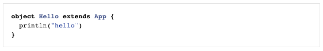
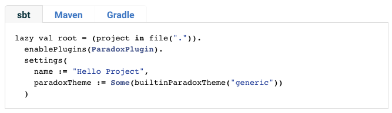

Snippet inclusion
-----------------

### @@snip block

The `@@snip` block is used to include code snippets from another file.

```markdown
@@snip [Hello.scala](../scala/Hello.scala) { #hello_example }
```

Inside of `Hello.scala` mark the desired section you want to extract using the `#hello_example` label as follows:

```scala
// #hello_example
object Hello extends App {
  println("hello")
}
// #hello_example
```

This lets us compile and test the source before including it in the documentation.
The snippet is rendered with code formatting like this:



To display multiple snippets in a tabbed view, use definition list syntax as follows:

```markdown
sbt
:   @@snip [build.sbt](/../../../build.sbt) { #setup_example }
Maven
:   @@snip [pom.xml](../../../pom.xml) { #setup_example }
Gradle
:   @@snip [build.gradle](../../../build.gradle) { #setup_example }
```

This will be rendered like this:



By default, Paradox uses Prettify to highlight code and will try to detect the
language of the snippet if it is not explicitly provided. In cases where a
snippet should not be highlighted use:

```markdown
@@snip [example.log](example.log) { #example-log type=text }
```

### snippet.base_dir

In order to specify your snippet source paths off a certain base directory you can define a snippet.base_dir property either in the page's front matter or globally like this (for example):

```sbt
paradoxProperties in Compile ++= Map(
  "snippet.base_dir" -> s"${(sourceDirectory in Test).value}/scala/org/example"
)
```

You can then refer to this snippet base directory by starting a snippet path with .../, e.g.

```markdown
@@snip [Hello.scala](.../Hello.scala) { #hello_example }
```

**Note**: Using this feature will not allow GitHub to preview the images correctly on the web.
